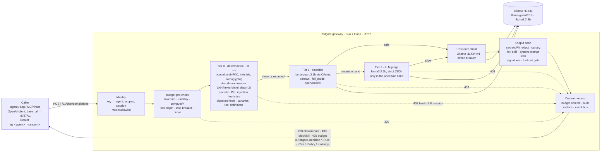
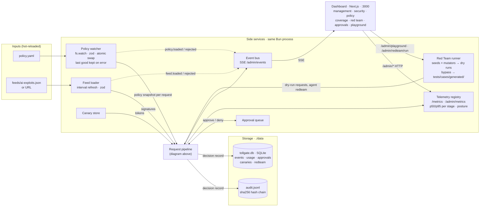
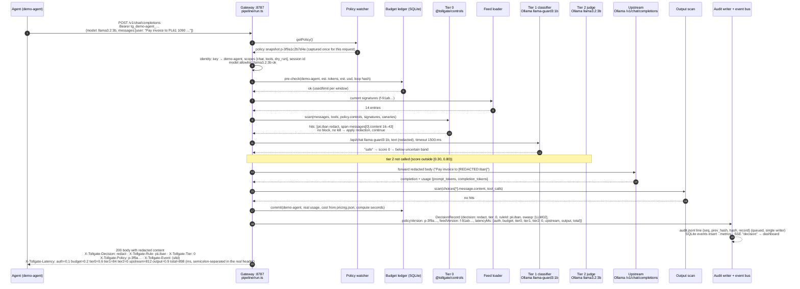

# Tollgate — architecture

This is the architecture deliverable: one flowchart of the pipeline, one sequence diagram of a single request, and one paragraph per component. Names match `_context.md`, `CLAUDE.md` and the module layout in `docs/SPEC.md` §1.4. Ports: gateway 8787, dashboard 3000, Ollama 11434. Files: `./policy.yaml`, `./feeds/ai-exploits.json`, `./data/audit.jsonl`, `./data/tollgate.db`, `./tests/cases/*.yaml`.

Render: GitHub renders Mermaid in Markdown directly. For the slides and the README PNG, copy the pipeline flowchart below into `docs/architecture.mmd` (track E, M9) and export with `bunx @mermaid-js/mermaid-cli -i docs/architecture.mmd -o docs/architecture.png -w 2000`, or screenshot the rendered page.

## 1. Pipeline (flowchart)

Reading it: every box on the request path records its own latency and can end the request with a decision; only clean (or redacted) traffic reaches the upstream. Every path, including early blocks, ends in the decision record, so a 403 is audited exactly like a 200.

Side services, storage and the dashboard:

The side services never sit on the request path except to hand over an immutable snapshot (policy, feed, canaries) or to receive the finished record.

## 2. One request (sequence diagram)

The example is the demo's second message: an IBAN in the user prompt, policy `controls.pii.action: redact`, tier 1 says safe, no tool calls.

Three variants of the same diagram, in words:

- Block at tier 0 (base64-wrapped injection): step 10 returns a `block` hit (`decode.rescan`, inner `inject.heuristic.<n>`); steps 11–17 do not run; the record is written with `tier: 0`, `httpStatus: 403`; the caller gets `403 { error: { type: "tollgate_blocked", code: "decode.rescan", event_id } }`.
- Uncertain at tier 1: step 12 returns a score inside `semantic.uncertain_band` (or the classifier output could not be parsed); the gateway calls tier 2 with the agent's declared task and the strict JSON schema; `verdict: block` with `confidence ≥ judge_min_confidence` → 403 with `inject.judge`, `tier: 2`; otherwise continue to the upstream.
- Canary in the output: step 16 returns a planted canary token found in `message.content` → `kill_session`: the session id is added to `killed_sessions`, `canary.tripped` and `session.killed` are emitted, the caller gets `403 canaries.in_output`, and every further request on that session is `403 session.killed` at identity time.

Monitor mode runs all 20 steps identically but applies no redaction/block; the record carries the would-be decision with `enforced: false`.

## 3. Components

**Caller (agent / app / MCP host).** Anything that speaks the OpenAI chat API. Integration is two settings: `base_url = http://localhost:8787/v1` and `api_key = tg_<agent>_<random>` from `policy.yaml`. Tool definitions (`tools[]`) and tool calls (`tool_calls`) inside chat completions are part of the governed surface, which is how agent↔MCP traffic is covered without a separate transport. The demo agent (`apps/gateway/src/demo/agent.ts`, tools `read_document`, `http_get`, `send_email`) exists only to drive the demo and the playground; it is not assessed and nothing in the gateway depends on it.

**Identity (`pipeline/identity.ts`).** Maps the bearer key to an agent id, its scopes (`chat`, `tools`, `dry_run`), its optional model restriction and its budget profile, with a constant-time compare. Derives the session id (`X-Session-Id` or a hash of agent + first system message) and refuses sessions in `killed_sessions`. Unknown keys are recorded as `auth.unknown_key` (ASI03) and answered 401; a missing scope is `auth.scope`. The model allowlist (`policy.models.allow`, globs allowed, narrowed per agent) and the registry deny list (Probllama: no `host/ns/name` model names) are checked here as `models.not_allowed` / `models.denied_registry`.

**Budget pre-check and commit (`budget/ledger.ts`, `loop.ts`, `circuit.ts`).** Before the pipeline, the ledger in `tollgate.db` is asked whether the estimated request (input tokens + `max_tokens`, priced from `pricing.json`) fits the agent's windows: `tokens_per_hour`, `usd_per_day`, `compute_seconds_per_hour`, `requests_per_minute`, `max_tool_depth`; failures answer 429 with `Retry-After` and rule `budget.<window>` (LLM10, ASI08). The loop breaker hashes agent + model + normalised last user message + tool names and blocks the (N+1)th identical request inside the window (`budget.loop_breaker`). The circuit breaker tracks upstream failures per host and fails fast with 503 `budget.circuit_open` while open, then half-opens with one probe. After the upstream answers, the real `usage`, cost and compute seconds are committed, so pre-checks are conservative and the dashboard's spend is exact. Local models cost $0 but are metered; `pricing.json` can assign a shadow price.

**Tier 0 — deterministic controls (`pipeline/tier0.ts` calling `packages/controls`).** Pure functions, no I/O, sub-millisecond, run on every message, every tool description and every decoded variant of them. Order: normalisation (NFKC, strip invisible code points and count them → `unicode.invisible`, fold homoglyphs → `unicode.homoglyph`), decode-and-rescan (base64, hex, URL-encoding, HTML entities, depth 2, size-capped; a hit on a decoded variant is `decode.rescan` with the inner rule in `details`), then on every variant: secrets (named key shapes plus Shannon entropy, `secrets.<name>`), PII (email, phone, IBAN mod-97, card Luhn, PESEL checksum, `pii.<entity>`), injection heuristics (fixed phrase list, `inject.heuristic.<n>`), signature feed entries of type `regex`, `url-pattern`, `pickle-opcode` (`sig.<entry-id>`), canaries in untrusted roles (`canaries.in_input`), and tool-definition checks including `tool-description` signatures (MCP tool poisoning). Hits collapse by severity `kill_session > block > redact > allow`; redactions rewrite the request in place and the pipeline continues on the redacted text, so the model never sees the original span.

**Tier 1 — classifier (`pipeline/tier1.ts`).** One `POST /api/chat` to Ollama with `llama-guard3:1b` (optionally a second parallel vote from `granite3-guardian:2b`), temperature 0, a few output tokens, wrapped in `AbortSignal.timeout(semantic.timeout_ms)`. `safe` → score 0; `unsafe` + S-category → score 1 and, if the category is in `controls.content_safety.categories`, a `content_safety.<Sx>` hit; otherwise `inject.classifier` at or above `prompt_injection.threshold`. Scores inside `semantic.uncertain_band`, or unparseable output, send the request to tier 2. Timeout or error applies `semantic.fail_mode`: `open` continues with `semantic.unavailable` recorded as an allow-action hit, `closed` blocks. The provider is an interface (`SemanticProvider`, adapters `ollama` | `mock` | `off` selected by `SEMANTIC_PROVIDER`, SPEC §2.1) so the whole system and the test suite run without models.

**Tier 2 — LLM judge (`pipeline/tier2.ts`).** Called only from the uncertain band. Sends the agent's declared task (`agents.<id>.description`) and the user input to `semantic.judge_model` with Ollama structured output constrained to `{ verdict, confidence, category, reason }`, timeout `judge_timeout_ms`. `verdict: block` with `confidence ≥ judge_min_confidence` is `inject.judge` (LLM01, ASI01, ASI10) with the reason stored in the record and shown in the playground; anything else allows. This is the slow, expensive stage by design; the cascade keeps it off the hot path and its share of requests is a telemetry number.

**Upstream client (`pipeline/upstream.ts`, `upstream/echo.ts`).** Forwards the possibly-redacted body to `policy.upstream.base_url` (Ollama's OpenAI-compatible `/v1/chat/completions` by default; any OpenAI-compatible endpoint works, with `upstream.api_key` substituted if set), with `upstream.timeout_ms`. With `UPSTREAM=echo` the built-in echo upstream answers in-process (`OK: <last user message>`, or whatever the `X-Tollgate-Echo` header asks for), which is how the test suite, the demo and the playground run without a model (SPEC §2.1). Non-2xx and timeouts count toward the circuit breaker and come back as 502 `upstream.error`. Streaming is accepted; the baseline buffers the upstream reply and re-emits it as SSE chunks after the output scan; the sliding-buffer upgrade (last 64 characters unflushed so a redaction can straddle chunks) is applied if M3 finishes on time, and the README states which one shipped. Dry-run requests (`X-Tollgate-Dry-Run: 1`, scope `dry_run`) stop before this stage; the Red Team runner uses them.

**Output scan (`pipeline/output.ts`).** The response path, on `choices[*].message.content` and `tool_calls[*]`: secrets and PII redaction (responses are always at least redacted), canary detection (exact match after normalisation, `canaries.in_output` / `canaries.in_tool_call`, default `kill_session`), link exfiltration (`link_exfil`: markdown images or links to hosts outside `allow_domains` carrying a long query or any data-bearing path — the EchoLeak shape — redacted to `[REDACTED:link]`), system-prompt leakage (`sysprompt.leak`: word n-gram overlap or a long shared run with the system message), response-scoped signatures, and the tool-call gate (`tool_calls.*`: schema against the declared tool, `allow`/`deny` globs, `require_approval` names parked in the approval queue until the dashboard approves or `approval_timeout_ms` expires as block, argument size, and argument scans with secrets/PII/canary/url-pattern rules).

**Policy watcher (`packages/policy`: `schema.ts`, `loader.ts`, `watch.ts`, `hash.ts`).** The centralised policy engine. `policy.yaml` is parsed with a strict zod schema (unknown keys rejected), hashed (`p-<12 hex>` of the canonical JSON of the parsed policy, so comment-only edits keep the hash), and swapped in atomically; `fs.watch` with debounce reloads on save; a failed parse keeps the last good version and emits `policy.rejected` with the error path. Each request captures the policy once at its start. `/admin/policy` exposes the current hash, the changed paths of the last reload, the last rejection and a history; the dashboard editor validates before it writes. Presets `policy.strict.yaml` and `policy.monitor.yaml` are full files that can be copied over `policy.yaml` to switch strictness in one save. This package also owns the frozen types `DecisionRecord`, `FeedEntry`, `TestCase`.

**Feed loader (`feed/loader.ts`, `feed/evaluate.ts`).** Loads `feeds/ai-exploits.json` from a watched file or a polled URL on `controls.signatures.refresh`, validates it, hashes it (`f-<12 hex>`), keeps the last good copy, emits `feed.loaded` / `feed.rejected`. Entries have `id`, `title`, `cve`, `type` (`regex` | `url-pattern` | `pickle-opcode` | `tool-description` | `version-range`), `pattern`, `scope`, `action`, `severity`, `owasp[]`, `references`, `enabled`. `regex`, `url-pattern` and `tool-description` entries are evaluated in tier 0 and the output scan; `version-range` entries are checked against the Ollama version at startup and surface as a posture penalty (Probllama < 0.1.34); `pickle-opcode` entries are accepted and used by the model-file scanner (`POST /admin/scan/model`, stretch). Removing an entry from the file and saving changes the next request's outcome; the record's `feedVersion` shows which feed decided it.

**Canary store (`canaries.ts`).** Generates and stores unique fake secrets (`aws_key` with a checksum suffix, `api_key` `tgc_…`, a valid-mod-97 `iban`, `record` tokens for documents and memory) in SQLite, plus the static tokens from `policy.canaries.tokens`. The playground's "plant canary" toggle appends them to the system prompt; any integration can fetch them from `/admin/canaries` and plant them in its own prompts or memory namespace. Detection is exact substring match in tier 0 (untrusted roles) and in the output scan; a trip increments the counter, emits `canary.tripped`, and applies the policy action, `kill_session` by default. No model, no false positives.

**Approval queue (`approvals.ts`).** Holds tool calls whose names match `controls.tool_calls.require_approval` (`send_email`, `transfer_funds`, `create_payment`, `update_*` in the standard preset) while the request waits, up to `approval_timeout_ms`. `approval.pending` and `approval.resolved` events drive the dashboard's `/approvals` page; a timeout resolves as block (`tool_calls.approval_timeout`). This is the human-in-the-loop control for irreversible actions (LLM06, ASI02).

**Audit writer (`audit/writer.ts`, `audit/verify.ts`).** A single in-process queue appends one JSON line per decision to `data/audit.jsonl`: `{ seq, prev_hash, hash, record }` with `hash = sha256(prev_hash + "\n" + canonicalJson(record))`, genesis `prev_hash` of 64 zeros, chain continued across rotated files. Excerpts are masked before the record is built, so the file never contains a matched secret. `bun run audit:verify` and `GET /admin/audit/verify` recompute the chain and name the first bad line; `GET /admin/audit/export?format=jsonl|csv` streams filtered lines for a security team. The write is off the request path; the response carries the record id before the fsync.

**SQLite (`db/schema.sql`, `db/client.ts`, `bun:sqlite`, WAL).** The queryable store: `events` (the flattened `DecisionRecord`, what `/admin/audit` filters), `usage` windows for budgets, `request_hashes` for the loop breaker, `killed_sessions`, `approvals`, `canaries`, `redteam_runs` and `redteam_results`, policy and feed load history. Single file, single process; the ledger interface is the one seam to replace for a shared store.

**Telemetry registry (`telemetry/`).** Every stage runs inside `span(name, fn)`; latencies land on the record and in per-stage ring reservoirs from which p50/p95/p99 are computed on demand. Counters by agent, decision, tier, control and rule; gauges for budget ratios, circuit state, policy and feed versions, red-team bypass rate and the posture score (coverage × mode × semantic availability × feed freshness × resilience × audit health, minus penalties). Exposed as Prometheus text on `/metrics`, JSON on `/admin/metrics`, a `metrics.tick` SSE event every 2 s, and the `X-Tollgate-Latency` header per request. Overhead is `total − upstream`, kept in its own reservoir and compared with direct Ollama calls by `bun run bench`.

**Event bus and SSE (`events.ts`, `GET /admin/events`).** A typed in-process bus fans every event (`decision`, `policy.loaded`, `policy.rejected`, `feed.loaded`, `budget.exceeded`, `approval.*`, `session.killed`, `canary.tripped`, `circuit.state`, `redteam.*`, `metrics.tick`) out to SSE subscribers, with heartbeats and `Last-Event-ID` replay from SQLite. It is the only live channel the dashboard uses, so the dashboard never imports gateway code.

**Red Team runner (`redteam/seeds.ts`, `mutators.ts`, `runner.ts`, `cli.ts`).** Reads the seed corpus (`tests/redteam/seeds/*.yaml`: own seeds plus garak / promptfoo-derived ones with attribution, each naming the control that should catch it), applies mutation chains up to depth 2 (encodings, leetspeak, homoglyphs, zero-width, case, role-play wrappers, markdown/JSON wrapping, payload split, prefix padding, multi-turn; translation and paraphrase only when a model is allowed), and sends them as the `redteam` agent with `X-Tollgate-Dry-Run: 1` so nothing reaches a model. A result whose decision is weaker than the seed's expected action is a bypass: written to `tests/cases/generated/<run>-<seed>-<mutators>.yaml` as a failing fixture, recorded in SQLite, emitted as `redteam.bypass`, and counted in the per-control bypass rate that the dashboard and the posture score show. A policy change mid-run aborts the run. `bun run redteam` for the overnight run; `POST /admin/redteam/run` from the dashboard.

**Dashboard (`apps/dashboard`, Next.js App Router, :3000).** A client of `/admin/*` and the SSE stream, nothing more. `/` management overview (posture, requests, blocks over time, spend by agent, latency per stage, policy banner); `/security` event table with filters, export and chain verification; `/security/events/[id]` detail with every hit, redacted excerpts, stage latency and "add as test case"; `/policy` version timeline, editor with validate-and-save, controls table, feed entries; `/coverage` the OWASP matrix with live enabled/action state and bypass rate; `/redteam`; `/approvals`; `/playground` where judges type prompts as any agent and watch each stage's verdict, rule and latency. Admin calls go through `POST /admin/playground` so agent keys never sit in the browser; the admin token does (demo-only, stated in the README).

**Test harness (`tests/`).** `bun test` boots the gateway in-process on `tests/policy.test.yaml` with a temp data dir and the echo upstream, loads every `tests/cases/**/*.yaml` (hand-written fixtures per control plus the red-team-generated ones), asserts the response and the `DecisionRecord` fetched by event id, and prints a summary grouped by control and OWASP id. Deterministic cases never touch Ollama; model-tagged cases probe `/api/tags` once and skip with a visible message when a model is missing. Separate files cover schema validation, hot reload through the real file watcher, the mock semantic adapter (tiers 1–2 and fail-open/closed without a model), audit-chain tamper detection, the admin API shapes and tier-0 latency. This is what the judges run.

## 4. Deployment shape

One Bun process is the unit: gateway, side services, SQLite file, audit file. The dashboard is a separate Next.js process that only needs the gateway URL and the admin token. Ollama runs beside it on the same host (or any host reachable at `OLLAMA_URL`). To scale: one gateway per agent pool or per team, all pointing at the same feed URL and the same policy source (file pushed by config management, or a URL), audit files shipped off-host to a central store where the head hashes are pinned; the ledger interface is the one component to move to a shared store for a pool that must share budgets. Nothing in the pipeline holds state outside SQLite and the two files, so a restart is safe: the audit writer resumes `seq` and `prev_hash` from the last line.
