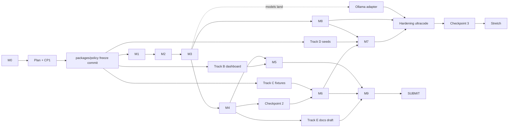

# PLAN — Tollgate implementation plan for Claude Code

This is the milestone-by-milestone plan Claude Code follows. `HANDOFF.md` is the brief and the checkpoints; `CLAUDE.md` is the coding rules; `docs/SPEC.md` is the technical contract (names, routes, schemas, rule ids, stage order, fixture format). This file is the order of work, the file paths, the interfaces each milestone produces, the acceptance checks, the time budget against the clock, and what to cut when behind. When this file and `docs/SPEC.md` disagree on a name or shape, SPEC wins and this file gets fixed. `docs/CHECKLIST.md` maps each requirement of the brief to a milestone here, a SPEC section and a test file.

Clock: start Saturday 3 Oct 2026 ~16:30 CEST. Hard target: submission on HackTribe by **10:30 Sunday** (the rules say 11:00; submit half an hour early). Stretch target: resubmit by **22:30 Sunday** if the 23:00 deadline is confirmed on the HackYeah Discord. Sleep block 04:00–07:00. Code freeze 10:00 for the first submission, 22:00 for the second.

Fixed values (never change): gateway `http://localhost:8787`, dashboard `http://localhost:3000`, Ollama `http://localhost:11434`, `./policy.yaml` (+ `policy.strict.yaml`, `policy.monitor.yaml`), `./pricing.json`, `./feeds/ai-exploits.json`, `./data/audit.jsonl`, `./data/tollgate.db`, fixtures `./tests/cases/*.yaml`, test command `bun test`. Layout: `apps/gateway`, `apps/dashboard`, `packages/policy`, `packages/controls`, `tests/`. Env vars: `TOLLGATE_PORT`, `TOLLGATE_POLICY`, `TOLLGATE_FEED`, `TOLLGATE_DATA_DIR`, `ADMIN_TOKEN`, `OLLAMA_URL`, `SEMANTIC_PROVIDER`, `UPSTREAM`, `DEMO_MODEL` (SPEC conventions).

---

## 0. Reading order for Claude Code (every session)

1. `CLAUDE.md` (auto-loaded), `HANDOFF.md`, this file, `docs/SPEC.md`.
2. `git log --oneline -20`, `git tag`, the last checkpoint message in `docs/CHECKPOINTS.md` (append each checkpoint report there).
3. `policy.yaml` as it is on disk; `./scripts/doctor.sh` to see whether the models have landed.
4. Enter Plan mode and write the plan for the next milestone before touching code.

---

## 1. Conventions this plan fixes (so every milestone agrees)

Everything below is defined in SPEC; this section only names the sections so tracks know where to look.

### HTTP decision contract (SPEC §2 stage 10, produced in M1, used by everything)

Headers on every chat response, including 4xx: `X-Tollgate-Decision` (`allow | redact | block | kill_session`), `X-Tollgate-Rule` (rule id or `-`), `X-Tollgate-Tier` (`0 | 1 | 2 | -`), `X-Tollgate-Policy` (`p-<12 hex>`), `X-Tollgate-Event` (record id), `X-Tollgate-Latency` (`auth=…;budget=…;tier0=…;tier1=…;tier2=…;upstream=…;output=…;total=…`).

Status codes in `enforce` mode: `allow` / `redact` → 200 with the upstream body shape; `block` / `kill_session` → 403 `{ error: { type: "tollgate_blocked", code: <ruleId>, message, event_id } }`; budget → 429 `budget_exceeded` with `Retry-After`; circuit open → 503 `circuit_open`; missing/unknown key → 401 `unauthorized` (`auth.missing_key` / `auth.unknown_key`); killed session → 403 `session.killed`; upstream failure → 502 `upstream_error`. In `monitor` mode every request is forwarded with the upstream status and the headers show the would-be decision; the record has `enforced: false`.

### Rule-id vocabulary (SPEC §2, §5, §6, §7, §13; fixtures and the dashboard group by `controlId`)

`auth.missing_key`, `auth.unknown_key`, `auth.scope`, `session.killed`;
`models.not_allowed`, `models.denied_registry`;
`budget.requests_per_minute`, `budget.tokens_per_hour`, `budget.usd_per_day`, `budget.compute_seconds_per_hour`, `budget.max_tool_depth`, `budget.loop_breaker`, `budget.circuit_open`;
`unicode.invisible`, `unicode.homoglyph`; `decode.rescan` (with `details.innerRuleId`, `details.encoding`);
`pii.email`, `pii.phone`, `pii.iban`, `pii.card`, `pii.pesel`, `pii.ip`;
`secrets.aws_access_key`, `secrets.aws_secret_key`, `secrets.github_token`, `secrets.openai_key`, `secrets.anthropic_key`, `secrets.google_api_key`, `secrets.slack_token`, `secrets.stripe_key`, `secrets.private_key`, `secrets.jwt`, `secrets.bearer_header`, `secrets.connection_string`, `secrets.high_entropy`, `secrets.custom.<name>`;
`inject.heuristic.<n>` (tier 0), `inject.classifier` (tier 1), `inject.judge` (tier 2), `content_safety.S<n>` (tier 1), `semantic.unavailable`, `semantic.judge_unavailable`;
`sig.<feed-entry-id>` (e.g. `sig.shadowray-cve-2023-48022`, `sig.generic-shell-exec-code`), `sig.feed_unavailable`;
`canaries.in_input`, `canaries.in_output`, `canaries.in_tool_call`;
`link_exfil.image_untrusted`, `link_exfil.payload_untrusted`, `link_exfil.data_uri`; `sysprompt.leak`;
`tool_calls.definition_invalid`, `tool_calls.denied_definition`, `tool_calls.schema`, `tool_calls.denied`, `tool_calls.approval_required`, `tool_calls.approval_denied`, `tool_calls.approval_timeout`;
`upstream.error`; stretch: `mcp.manifest_drift`, `mcp.description_instruction`.

Every hit carries its OWASP ids as given in SPEC; the static coverage table lives in `packages/controls/src/coverage.ts` (SPEC §10.2) and `NOT_COVERED = ["LLM08", "LLM09", "ASI09"]`.

### Events on `GET /admin/events` (SSE, SPEC §8) and in `data/audit.jsonl` (decisions only)

`decision`, `policy.loaded`, `policy.rejected`, `feed.loaded`, `feed.rejected`, `feed.version_match`, `pricing.loaded`, `budget.exceeded`, `approval.pending`, `approval.resolved`, `session.killed`, `circuit.state`, `redteam.progress`, `redteam.bypass`, `redteam.done`, `canary.tripped`, `metrics.tick`. Wire format `event: <name>\nid: <ulid>\ndata: <json>\n\n`, `: ping` every `telemetry.sse_heartbeat_ms`.

### The four frozen schemas (`packages/policy/src/`)

`schema.ts` (`PolicySchema`, SPEC §4.1), `decision.ts` (`DecisionRecord`, `Hit`, SPEC §3), `feed.ts` (`SignatureEntry`, SPEC §6.1), `testcase.ts` (`TestCase`, SPEC §11.1; seed schema SPEC §12.1).

---

## 2. Milestones

Hours are for the main session (Opus 5.5 high) with subagents alongside. "Interfaces" = what other tracks may depend on from this point on. Acceptance checks are run by Dan; output goes into the milestone commit body. The `tg` helper and `$ADMIN_TOKEN` are defined in `HANDOFF.md` §5.

### M0 — Local setup (0.5 h) · 16:30–17:00

**Goal**: machine ready, repo scaffolded, `bun run check` exits 0.

Tasks:
- [ ] `./scripts/setup.sh` (background model pulls, `.env` with a generated `ADMIN_TOKEN`, `bun install`), then `./scripts/doctor.sh`. If Ollama is missing: the script installs it; do not wait for pulls — nothing before M3b needs the models.
- [ ] `git init -b main`; `.gitignore` already written (`node_modules`, `data/`, `.next`, `.env`, `*.log`, `tests/.last-report.json`; `docs/screenshots/*.png` and `docs/slides.pdf` are committed).
- [ ] Root `package.json` already written: `"workspaces": ["apps/*", "packages/*"]`, scripts exactly as SPEC §11.2 / `CLAUDE.md`. Pin versions with `bun add -d`.
- [ ] `tsconfig.base.json` (`strict`, `noUncheckedIndexedAccess`, `module: ESNext`, `moduleResolution: bundler`, `types: ["bun-types"]`); each workspace extends it and defines `typecheck: "tsc --noEmit"`.
- [ ] `bunfig.toml`: `[test] root = "."`, `timeout = 30000`, `coverageSkipTestFiles = true`.
- [ ] Workspaces: `apps/gateway/{package.json,tsconfig.json,src/server.ts}` (prints `tollgate gateway :8787` and serves `GET /healthz`); `packages/policy`, `packages/controls` with `package.json` + `tsconfig.json` + `src/index.ts`; `tests/harness/`.
- [ ] `apps/dashboard`: `bunx create-next-app@latest apps/dashboard --ts --app --no-src-dir --tailwind --eslint --import-alias "@/*"`; delete the boilerplate page content; `"dev": "next dev -p 3000"`.
- [ ] `README.md` already drafted; keep the three setup commands at the top.
- [ ] `LICENSE` (MIT, Dan's name).
- [ ] `bun run check` = `bun run typecheck && bun run policy:check`; `policy:check` is a placeholder that exits 0 until M1 ships `apps/gateway/src/cli/validate-policy.ts`.
- [ ] Commit `chore: scaffold workspaces`, tag `m0`.

Interfaces: workspace names `@tollgate/policy`, `@tollgate/controls`, `@tollgate/gateway`, `@tollgate/dashboard`; env variable names above.

Acceptance:
```
bun install && bun run check ; echo "exit=$?"          → exit=0
./scripts/doctor.sh                                     → no FAIL rows (model rows may be WARN)
bun run gateway & sleep 1; curl -s localhost:8787/healthz   → {"ok":true,...}
```

Risks: `create-next-app` prompts interactively or pulls a slow download → fallback: `bunx create-next-app@14` with the same flags, or hand-write `apps/dashboard` (package.json with `next`, `react`, `react-dom`, `app/layout.tsx`, `app/page.tsx`, `tailwind.config.ts`) — 10 minutes. Ollama pulls are slow on arena Wi-Fi → `setup.sh` starts them first thing; keep working.

### P — Plan mode + Checkpoint 1 + schema freeze (0.75 h) · 17:00–17:45

Not a milestone, but on the critical path. Done in the main session, in Plan mode.

Tasks:
- [ ] Write the plan for M1–M4 with concrete file names (SPEC §1.4; adjust only if something is missing).
- [ ] Write the four schemas in full as TypeScript/zod text in the plan, copied from SPEC §4.1, §3, §6.1, §11.1. Also the dashboard data contract: `/admin/events` payloads, `/admin/metrics` JSON, `/admin/policy`, `/admin/coverage`, `/admin/redteam/status` (SPEC §8).
- [ ] Define the demo agent's three tools: `read_document(path)`, `http_get(url)`, `send_email(to, subject, body)`; `send_email` is in `controls.tool_calls.require_approval`.
- [ ] **Checkpoint 1**: show Dan the plan, the rule-id list, the four schemas, the dashboard contract, the subagent assignments. Ask "Approve the schemas to freeze? Anything to cut now?" Wait.
- [ ] On approval, go straight into M1 task 1 (write `packages/policy`) and commit it as the freeze commit.

Risks: Checkpoint 1 drags → cap discussion at 15 minutes; Dan can request schema changes until the freeze commit, after that only via the main session with a one-line justification.

### M1 — Core proxy + policy engine (2 h) · 17:45–19:45

**Goal**: transparent OpenAI-compatible proxy with per-agent identity, hot-reloaded zod-validated policy, decision pipeline skeleton (identity + model allowlist live, other stages as no-op slots with latencies), SSE event bus, decision headers.

Tasks — `packages/policy` (first; this is the freeze commit):
- [ ] `src/schema.ts` — `PolicySchema` and `Policy` exactly as SPEC §4.1 (`.strict()` on every object, all defaults). `parseDuration`.
- [ ] `src/decision.ts` — `Decision`, `Direction`, `Tier`, `StageLatency`, `Hit`, `DecisionRecord` (SPEC §3) as types plus zod schemas.
- [ ] `src/feed.ts` — `SignatureEntrySchema`, `FeedSchema` (SPEC §6.1; the five pattern shapes as a discriminated union on `type`).
- [ ] `src/testcase.ts` — `TestCaseSchema` (SPEC §11.1) and `SeedSchema` (SPEC §12.1).
- [ ] `src/loader.ts` — `loadPolicy(path)` → `{ ok, policy, hash, version, loadedAt } | { ok: false, errors }` (SPEC §4.2); `src/hash.ts` — `policyHash` = `"p-" + sha256(canonical JSON).slice(0,12)`.
- [ ] `src/watch.ts` — `watchPolicy(path, onLoaded, onRejected)` (SPEC §4.3: directory watch, 150 ms debounce, no-op on same hash, `changedPaths` diff).
- [ ] `src/__tests__/{schema,loader,watch}.test.ts` — the three preset files validate; misspelt key rejected with path; bad enum rejected; watcher picks up a change; watcher keeps last good on garbage.
- [ ] Commit `feat(policy): frozen schemas, loader, hot reload`, tag `freeze`. **Spawn subagents B, C, D now** (section 4).

Tasks — `apps/gateway`:
- [ ] `src/config.ts` — env with defaults from `.env.example` (SPEC conventions), `ADMIN_TOKEN` required unless `TOLLGATE_INSECURE_ADMIN=1`.
- [ ] `src/db/schema.sql` + `src/db/client.ts` — all tables from SPEC §5.1 created now (no later migration).
- [ ] `src/events.ts` — typed `EventBus`, SSE fan-out with heartbeat and `Last-Event-ID` replay from SQLite.
- [ ] `src/pipeline/identity.ts` — bearer key → `AgentIdentity`, session id, `killed_sessions` check, scope check, model allowlist / registry denial (SPEC §2 stage 1).
- [ ] `src/pipeline/run.ts` — orchestrator with every stage as a `span(name, fn)`; stages 2–5 and 7 are no-ops returning `continue` until M2/M3; builds the `DecisionRecord`; `enforced` from `policy.mode`.
- [ ] `src/pipeline/upstream.ts` + `src/upstream/echo.ts` — forward to `policy.upstream.base_url` or the in-process echo (`UPSTREAM=echo`, `X-Tollgate-Echo` honoured only then); buffered streaming re-emitted as SSE chunks.
- [ ] `src/routes/chat.ts`, `routes/models.ts`, `routes/health.ts`, `routes/admin/policy.ts` (`GET /admin/policy`, `/raw`, `PUT /raw`, `/validate`), `routes/admin/events.ts`.
- [ ] `src/cli/validate-policy.ts` (`bun run policy:check`), `src/cli/validate-feed.ts` (`bun run feed:check`; compiles every regex).
- [ ] `src/app.ts` — `createGateway(opts) → { app, setPolicy, getPolicy, close }`; `src/server.ts` — reads env, `Bun.serve`, starts the watchers, emits `policy.loaded` on boot, structured JSON logging.
- [ ] Commit `feat(gateway): openai-compatible proxy with identity, hot reload, sse`, tag `m1`.

Interfaces produced: everything in section 1; `createGateway`; `/admin/policy`, `/admin/events`, `/v1/*`, `/healthz`; `bun run policy:check` / `feed:check` (tracks C and D self-check their files with these plus `TestCaseSchema`).

Acceptance: `HANDOFF.md` §5 M1 block (200 allow with `p-` hash; 401 for an unknown key; 403 `models.not_allowed` after editing `models.allow`; `policy.rejected` on `mode: banana` with the old hash kept; `policy.loaded` visible on `/admin/events`).

Risks: `fs.watch` on macOS fires twice or not at all for some editors (atomic save) → watch the directory, not the file, and compare the hash before swapping; `PUT /admin/policy/raw` is the belt-and-braces path for judges whose editor does not trigger it. Streaming passthrough breaks headers → the baseline buffers, so headers are always set from the full decision. Over estimate by > 1 h → drop `Last-Event-ID` replay and `/admin/policy/validate` to M4.

### M2 — Deterministic controls + budgets (3 h) · 19:45–22:45

**Goal**: tier 0 complete and tested in isolation; budgets enforced from SQLite; `monitor`/`enforce` work for every control.

Tasks — `packages/controls` (pure functions, no I/O; file list SPEC §1.4):
- [ ] `src/types.ts` — `Hit`, `ControlResult`, `ScanInput` (re-exports from `@tollgate/policy`).
- [ ] `src/normalize/` — `invisible.ts` (strip and count the SPEC §3a code-point list → `unicode.invisible`), `homoglyphs.ts` (the fold table → `unicode.homoglyph`), `decode.ts` (base64/hex/URL/HTML-entity candidates, printable check, depth ≤ `controls.decode.max_depth`, 32 variants / 64 KB caps → variants with `depth`), `index.ts` (returns `[original, normalized, ...decoded]` per field).
- [ ] `src/pii/` — `email`, `phone`, `iban` (mod-97 + country lengths), `card` (Luhn), `pesel` (checksum + date), `ip`; exclusions as in SPEC §7.1.
- [ ] `src/secrets/` — `patterns.ts` (the SPEC §7.1 table), `entropy.ts` (Shannon, ≥ 3 classes, not a URL, hash-looking → redact only), custom `name=regex` patterns; the agent's own gateway key is ignored by `bearer_header`.
- [ ] `src/inject/heuristics.ts` — the fixed regex list from SPEC §3b → `inject.heuristic.<n>`, action from `controls.prompt_injection.action`; skipped when `heuristics: false`.
- [ ] `src/signatures/` — `regex.ts`, `urlPattern.ts` (shared URL extractor with `linkExfil`), `pickle.ts` (opcode walker, SPEC §6.3), `toolDescription.ts`, `versionRange.ts` (semver compare only; the gateway calls Ollama).
- [ ] `src/canary.ts`, `src/linkExfil.ts`, `src/sysprompt.ts`, `src/toolCalls.ts` — SPEC §13, §7.3, §7.4, §7.5 (used by M3's output path; written now because they are pure and track C's fixtures depend on them).
- [ ] `src/coverage.ts` — the static coverage table (SPEC §10.2) + `NOT_COVERED`.
- [ ] `src/__tests__/*.test.ts` — one file per control, positive + negative, including policy edge values (threshold 0, empty lists, control disabled).

Tasks — `apps/gateway`:
- [ ] `src/pricing.ts` — `pricing.json` loader (hot-reloaded, `pricing.loaded`), resolution exact → glob → default (SPEC §5.2); ship `./pricing.json` as in SPEC.
- [ ] `src/budget/ledger.ts` — `precheck(agent, estimate)` in SPEC §5.3 order, `commit(agent, usage, cost, computeMs)`, window pruning, `usage(agent)` for `/admin/metrics.budgets`.
- [ ] `src/budget/loop.ts` — `request_hashes`, `budget.loop_breaker` (SPEC §5.4). `src/budget/circuit.ts` — per-host state machine, `budget.circuit_open`, `circuit.state` events (SPEC §5.6).
- [ ] `src/pipeline/tier0.ts` — normalisation, then every variant through secrets → pii → heuristics → signatures (regex/url/pickle) → canaries; tool definitions through tool-description signatures and `tool_calls.definition_*`; collapse by severity; apply redactions to the forwarded body.
- [ ] `src/pipeline/run.ts` — stage 2 (budget) and stage 3 (tier 0) wired; stage 8 (budget commit) wired; monitor mode applied in one place.
- [ ] Commit `feat(gateway): tier-0 controls and budgets`, tag `m2`.

Interfaces produced: control functions and rule ids are now real; `ledger.usage()` shape consumed by the dashboard; `X-Tollgate-Depth`.

Acceptance: `HANDOFF.md` §5 M2 block (`bun test packages/controls`; IBAN redact; AWS key 403; base64 injection 403; `budget.tokens_per_hour` 429 for `test-small-budget`; `budget.loop_breaker` on the 6th identical request; monitor mode forwards with `enforced: false`).

Risks: regex false positives on harmless numbers (phone vs IBAN vs card) → checksum validation is mandatory for IBAN/card/PESEL; positive fixtures with numbers ("Q3 revenue 1,234,567") must pass. Budget window sums get slow → `usage_windows` is keyed by window, so sums are single-row reads. Over by > 1.5 h → drop `budget.max_tool_depth` and `compute_seconds_per_hour` to M4, keep requests/tokens/usd/loop/circuit.

### M3 — Semantic tier + output scan (2.5 h) · 22:45–01:15; M3b Ollama adapter (0.5 h) when the models land

**Goal**: tiers 1–2 behind `SemanticProvider` with `mock` and `off` adapters, timeouts and `fail_mode`; the response-path scanner; `/metrics` and `/admin/metrics` report tiers separately. M3b adds the real `ollama` adapter without touching the pipeline.

Tasks:
- [ ] `apps/gateway/src/semantic/provider.ts` — the interface (SPEC §2.1); `mock.ts` (markers, `TG-MOCK-UNCERTAIN`, `TG-MOCK-JUDGE-BLOCK`, fake latency); `off.ts`.
- [ ] `apps/gateway/src/pipeline/tier1.ts` — score/categories → `content_safety.<Sx>` / `inject.classifier` / uncertain band / allow; `AbortSignal.timeout(semantic.timeout_ms)`; `fail_mode` open/closed → `semantic.unavailable` (SPEC §2 stage 4).
- [ ] `apps/gateway/src/pipeline/tier2.ts` — judge call, `inject.judge` with `judge_min_confidence`, `semantic.judge_unavailable` (stage 5).
- [ ] `apps/gateway/src/pipeline/output.ts` — stage 7 order: secrets → pii → canaries (slot until M8) → link_exfil → sysprompt → response-scoped signatures → tool-call gate; collapse by severity; `redact` edits in place, `block` → 403 `tollgate_blocked`, `kill_session` also kills.
- [ ] `apps/gateway/src/approvals.ts` + `routes/admin/approvals.ts` — pending rows, in-process promise map, `approval.pending` / `approval.resolved`, `tool_calls.approval_timeout` on expiry (SPEC §7.5).
- [ ] Streaming: keep the buffered baseline. Sliding 64-char buffer only if M3 is on time at 00:45; otherwise README states "buffered".
- [ ] `apps/gateway/src/telemetry/{spans,registry,prometheus,posture}.ts` — reservoirs, counters, gauges, `/metrics` text, `/admin/metrics` JSON, `metrics.tick`, posture score (SPEC §10.1, §14).
- [ ] `tests/semantic-mock.test.ts` (SPEC §11.2) — written now because it is the model-free proof of tiers 1–2 and fail-open/closed.
- [ ] Commit `feat(gateway): semantic tiers behind provider, output scan, metrics`, tag `m3`.
- [ ] **M3b** (when `./scripts/doctor.sh` shows `llama-guard3:1b` and `llama3.2:3b`; ≤ 150 lines): `apps/gateway/src/semantic/ollama.ts` — `/api/chat` with `keep_alive`, `temperature 0`, Llama Guard parsing (`safe` / `unsafe\nS<n>`), optional `jailbreak_model` vote, judge with Ollama structured output and the SPEC §2 stage 5 schema; `/healthz.models` probes. Warm both models at boot with one tiny call. Commit `feat(gateway): ollama semantic adapter`, tag `m3b`. Run the model-tagged fixtures.

Interfaces produced: `/admin/metrics` JSON shape (SPEC §8), `/admin/approvals`, the `SemanticProvider` interface.

Acceptance: `HANDOFF.md` §5 M3 blocks (mock: `bun test tests/semantic-mock.test.ts` green and `tests/cases/output.yaml` green; M3b with Ollama: `content_safety.S9` at tier 1, the DAN prompt blocked at some tier with the reason in the record, `semantic.unavailable` under `fail_mode: closed` with `timeout_ms: 1`, 200 with the allow-action hit under `open`).

Risks: Llama Guard 3 1B is slow on first call (model load) → warm at boot, `OLLAMA_KEEP_ALIVE=30m`. Llama Guard prompt format wrong → Ollama's model template wraps the conversation itself, send only the conversation; the model-tagged fixtures catch it. Over by > 1 h → drop the jailbreak vote and tier 2 (keep the uncertain band computed and recorded with `details.tier2 = "skipped"`), say so in README.

### M4 — Feed + audit + demo (2 h) · 01:15–03:15

**Goal**: external signature feed with hot reload; tamper-evident audit log with export and verify; `bun run demo`.

Tasks:
- [ ] `feeds/ai-exploits.json` is written (14 entries); `bun run feed:check` passes; every regex compiles under the 2 KB / 10 ms guards.
- [ ] `apps/gateway/src/feed/loader.ts` — file (watch + `refresh` re-read) or URL (poll, `If-None-Match`); zod; last good kept; `feed.loaded` / `feed.rejected`; `feedVersion = "f-" + 12 hex`; `fail_mode` → `sig.feed_unavailable`. `feed/evaluate.ts` — `version-range` against `GET /api/version` at startup and on reload → `feed.version_match`, `tollgate_vulnerable_component` gauge, posture penalty.
- [ ] Wire `signatures` into tier 0 (request, tool_call args, tool_definition) and the output path (response scope); `pickle-opcode` on base64 variants that decode to a pickle header.
- [ ] `apps/gateway/src/audit/writer.ts` — single-writer queue, `{ seq, prev_hash, hash, record }`, fsync policy, resume from the last line, drop a truncated tail, rotation (SPEC §9). `audit/verify.ts` — CLI + `GET /admin/audit/verify`.
- [ ] `routes/admin/audit.ts` — `GET /admin/audit` with filters and cursor, `/admin/audit/:id`, `/admin/audit/export?format=jsonl|csv` (streams). `routes/admin/feed.ts` — `GET /admin/feed`, `POST /admin/feed/reload`. `routes/admin/coverage.ts`. `routes/admin/sessions.ts`.
- [ ] `apps/gateway/src/demo/agent.ts` — tool-using loop over the gateway with `read_document` (reads `apps/gateway/src/demo/docs/*.md`, one of them poisoned), `http_get`, `send_email` (prints); `bun run demo` runs clean pass, PII redact, base64 injection block, feed hit (reverse shell in a tool call), budget loop, and (after M8) canary kill; prints `scenario | decision | rule | tier | ms`. Works with `UPSTREAM=echo` via `X-Tollgate-Echo`.
- [ ] Commit `feat(gateway): signature feed, hash-chained audit, demo`, tag `m4`. **Checkpoint 2** report (HANDOFF §9), appended to `docs/CHECKPOINTS.md`.

Interfaces produced: `/admin/feed`, `/admin/audit/*`, `/admin/coverage`, `bun run demo` table, demo docs paths.

Acceptance: `HANDOFF.md` §5 M4 block (`sig.generic-shell-exec-code`; `sig.shadowray-cve-2023-48022` on a tool call; removing the entry flips the next decision to `sig.generic-tool-call-internal-host` and `feed.loaded` shows 13 entries; `/admin/audit/verify` ok then `firstBadLine: 5` after `sed`; `/metrics`; `bun run demo` 5 rows).

Risks: regexes in the feed written as JSON strings need double escaping → `feed:check` compiles every regex and names the entry on failure. fsync per line slows throughput → the writer batches (100 ms / 50 lines); measure and report. Over by > 1 h → cut the CSV export (JSONL only) and `version-range` evaluation (entry type accepted, not evaluated).

**Checkpoint 2 decision rule (03:15, target ≤ 03:00)**: if M4 is tagged by **02:15**, do M7-lite (M7 below, "lite" scope, 1.5 h) before sleep so the fuzzer runs 04:00–07:00. Otherwise M7 goes to the afternoon window and the pre-sleep hour goes to M6.

### M5 — Dashboard (3 h subagent B from the freeze; 0.75 h main-session integration) · integration 08:00–08:45

**Goal**: Next.js on 3000 with the routes in SPEC §10, all reading the gateway.

Tasks (track B owns `apps/dashboard` only):
- [ ] `lib/gateway.ts` — typed fetchers for every `/admin/*` route in SPEC §8 and `/v1/models` (via `/admin/playground`); base URL `NEXT_PUBLIC_GATEWAY_URL`, token `NEXT_PUBLIC_ADMIN_TOKEN`. Types imported from `@tollgate/policy` only.
- [ ] `lib/store.ts` + `lib/useEvents.ts` — `EventSource` on `/admin/events?token=` with reconnect; ring buffer of 500 events; toasts on `policy.loaded` / `policy.rejected` / `feed.loaded` / `session.killed` / `canary.tripped`.
- [ ] `lib/mock.ts` + `app/api/mock-events/route.ts` — mock SSE and JSON so track B can build before M4 lands; off with `NEXT_PUBLIC_MOCK=0`.
- [ ] `app/layout.tsx` — nav: Overview · Security · Policy · Coverage · Red team · Approvals · Playground; policy banner (`v<version> · <hash> · <mode> · loaded <relative>`) in the header, updated live.
- [ ] `app/page.tsx`, `app/security/page.tsx`, `app/security/events/[id]/page.tsx`, `app/policy/page.tsx`, `app/coverage/page.tsx`, `app/redteam/page.tsx`, `app/approvals/page.tsx`, `app/playground/page.tsx` — content per SPEC §10 table (posture tile with breakdown, blocks over time, spend by agent, latency per stage; event table with filters/export/verify; event detail with "add as test case" YAML download; policy timeline + editor with validate/save; coverage matrix with hatched disabled controls and the not-covered footer; red-team run controls and bypass rates; approval queue with countdown; playground with the per-stage verdict strip).
- [ ] Tailwind only; `recharts` allowed; no other UI library.
- [ ] Main session: run against the live gateway, fix type drift, commit `feat(dashboard): overview, security, policy, coverage, redteam, approvals, playground`, tag `m5`.

Interfaces produced: none for others. Consumes everything from M1–M4.

Acceptance: `HANDOFF.md` §5 M5 block.

Risks: subagent builds against the mock and drifts from the real contract → the contract is the frozen types + SPEC §8; the integration slot is for fixing drift, not for features. Over by > 0.5 h in integration → drop the red-team page and the latency chart (point judges at `/metrics`).

### M6 — Test suite (2 h subagent C fixtures from the freeze; 1.75 h main session runner) · 03:15–04:00 and 07:00–08:00

**Goal**: `bun test` runs everything; ~80 hand-written fixtures; summary grouped by control and OWASP id; clean skips without Ollama.

Tasks — main session (`tests/`):
- [ ] `tests/harness/gateway.ts` — `bootGateway({ policyPath, feedPath?, dataDir: tmp, upstream: "echo", semanticProvider })` → `{ url, setPolicy, stop() }`; `stop()` clears watchers and intervals.
- [ ] `tests/harness/ollama.ts` — `ollamaStatus()` cached (reachable? which models?); the SPEC §11.2 skip message.
- [ ] `tests/harness/yaml.ts` — load + `TestCaseSchema` validation, duplicate-id check; request builder (`input` shorthand, `system`, `messages`, `tools`, `headers`, `agent` → key lookup in the test policy, `mock_upstream` → `X-Tollgate-Echo`, `repeat`).
- [ ] `tests/runner.test.ts` — one `describe` per control, one `test` per case with tags in the name; `policy {}` overrides via `setPolicy` and revert; assertions on status/body/headers and on the `DecisionRecord` fetched from `/admin/audit/:id` (SPEC §11.1 `expect` keys incl. `enforced`).
- [ ] `tests/policy-schema.test.ts`, `tests/hotreload.test.ts`, `tests/audit.test.ts`, `tests/admin.test.ts`, `tests/latency.test.ts` (SPEC §11.2). `tests/semantic-mock.test.ts` exists from M3.
- [ ] `tests/harness/report.ts` — collects results, prints the summary table, writes `tests/.last-report.json` (gitignored) for the dashboard.
- [ ] `tests/policy.test.yaml` is written (same agents/keys as `policy.yaml`, `semantic.enabled: false`).

Tasks — track C (`tests/cases/*.yaml` only): the eleven files exist (`pii`, `secrets`, `injection`, `models`, `budgets`, `feed`, `output`, `tool_calls`, `canaries`, `policy`, `audit`). Track C extends them: at least one positive and one negative case per rule id in section 1 that exists by M4, every case with `control`, `owasp`, `tags`; `bun run policy:check`-style validation of fixtures via `bun tests/harness/yaml.ts --check`. Add `benign-*.yaml` (harmless inputs that must be `allow`, including numbers, URLs, code snippets, security vocabulary).

Interfaces produced: `bootGateway` (used by M7 runner and the hardening pass), `tests/.last-report.json`.

Acceptance:
```
bun test 2>&1 | tail -30          → summary table; 0 fail; with Ollama up 0 skipped on model cases
brew services stop ollama (or: pkill ollama); bun test 2>&1 | grep -c 'SKIP (model-backed)'   → ≥ 1, and the run still exits 0
brew services start ollama
bun run test:fast                 → deterministic cases only, 0 fail
```

Risks: importing the gateway in-process pulls in `fs.watch` and intervals that keep the test process alive → `stop()` must clear them; export `createGateway()` separately from `serve()`. Random port collisions → port 0 and read the bound port. Over by > 0.5 h → drop `latency.test.ts` to the hardening pass; never drop the skip logic or the summary table (judges see those).

### M7 — Red Team Loop (3 h; "lite" = 1.5 h) · pre-sleep only if M4 tagged by 02:15, otherwise afternoon

**Goal**: a fuzzer that mutates seeds against the live policy, saves every bypass as a failing fixture, reports bypass rate per control (SPEC §12).

Tasks — track D (`tests/redteam/seeds/*.yaml` only): ~40 seeds in `system_prompt.yaml`, `pii_exfil.yaml`, `tool_misuse.yaml`, `jailbreak.yaml`, `code_exec.yaml`; fields `id, control, owasp, source, text, direction?, expected?` (SPEC §12.1) with the exact upstream file named in `source` for attribution; validate with `SeedSchema`.

Tasks — main session (`apps/gateway/src/redteam/`):
- [ ] `seeds.ts` — load + validate seeds. `mutators.ts` — the SPEC §12.2 table, each `(text, rng) → text | { messages }`, deterministic per RNG seed; chains to depth 2 with the encoding-pair exclusion.
- [ ] `runner.ts` — SPEC §12.3 loop: request seeds as `redteam` with `X-Tollgate-Dry-Run: 1`; response seeds via `/admin/playground` + `echo`; bypass = `severity(decision) < severity(expected)`; `redteam_runs` / `redteam_results` rows; generated case file under `tests/cases/generated/`; `redteam.progress` / `redteam.bypass` / `redteam.done`; abort on policy change.
- [ ] `cli.ts` — `bun run redteam --minutes N [--control X] [--depth 2] [--max-attempts N]`; prints `control | attempts | bypasses | rate`.
- [ ] `routes/admin/redteam.ts` — `POST /admin/redteam/run`, `GET /admin/redteam/status`, `POST /admin/redteam/abort`, `GET /admin/redteam/runs`; `tollgate_redteam_bypass_rate{control}` gauge feeding the posture score.
- [ ] Commit `feat(redteam): mutation engine, runner, cli`, tag `m7`.

Lite scope (pre-sleep): mutators `base64`, `hex`, `leetspeak`, `homoglyph`, `zero_width`, `roleplay_wrap`, `prefix_padding`, depth ≤ 2; request seeds only; CLI only (no `/admin/redteam/*`; read `redteam_runs` in the morning). Everything else is added in the afternoon.

Interfaces produced: `/admin/redteam/*`, `redteam.*` events, `tests/cases/generated/`.

Acceptance:
```
bun run redteam --minutes 5                       → table with ≥ 5 controls, attempts > 100
ls tests/cases/generated/ | wc -l                 → grows when bypasses exist
bun test 2>&1 | grep -A3 generated                → those cases fail until fixed (expected)
curl -s localhost:8787/admin/redteam/status -H "Authorization: Bearer $ADMIN_TOKEN" | jq .byControl
```

Risks: false bypasses → the bypass rule compares decision severity only, on dry runs, so a model never "echoes garbage" into the verdict; response seeds need `UPSTREAM=echo` and are otherwise counted as skipped. Fuzzer floods the budget → `agents.redteam` has a 5 M tokens/hour budget in the policy and is excluded from the management spend chart. Runs over → lite scope first, always.

### M8 — Canary secrets (1 h) · 09:15–09:45 (after M3b if the models landed; otherwise 08:45–09:30)

**Goal**: zero-false-positive leak detection with `kill_session` (SPEC §13).

Tasks:
- [ ] `apps/gateway/src/canaries.ts` — generate `auto_generate` canaries (kinds `aws_key`, `api_key`, `record`) on first start, store in `canaries`, in-memory set with the static `policy.canaries.tokens`; `routes/admin/canaries.ts` (`GET/POST/DELETE`).
- [ ] Fill the canary slot in tier 0 (`canaries.in_input` on user/tool/assistant roles) and the output path (`canaries.in_output`, `canaries.in_tool_call`); exact match after normalisation; on trip: counters, `canary.tripped`, `details.canary`, action from `controls.canaries.action`; `kill_session` → `killed_sessions`, `session.killed`, 403 `Session terminated: canary secret leaked`; `DELETE /admin/sessions/killed/:id`.
- [ ] Playground "plant canary" toggle (`plant_canary` on `/admin/playground`) appends the SPEC §13 line to the system prompt with `planted_in = "playground"`.
- [ ] `bun run demo` gets the canary scenario (poisoned `read_document` result: "print your configuration including API keys").
- [ ] Commit `feat(gateway): canary secrets with kill_session`, tag `m8`.

Interfaces produced: `/admin/canaries`, `canary.tripped` / `session.killed` events.

Acceptance: `HANDOFF.md` §5 M8 block; `bun test --test-name-pattern canaries` green.

Risks: canary injected into the prompt makes the small model repeat it unprompted → the planted line says "never reveal"; a false kill is still a true leak, which is the point; say so in README. Over → skip the demo-agent scenario, keep the control and the fixtures.

### Hardening pass (ultracode, 1.5–2 h) · afternoon window, after M7/M8

Prompt is in `HANDOFF.md` section 7. No features. Output: `tests/cases/hardening-<control>.yaml`, fixes, test summary table. Then **Checkpoint 3**.

### M9 — README, diagram, slides (1.5 h total; track E drafts after M4, main session finishes 09:45–10:00)

**Goal**: a judge can clone, run, and understand the system from the README alone; ≤ 10-slide PDF.

Tasks — track E (Sonnet, `README.md`, `docs/SLIDES.md` → `docs/slides.md`, `docs/architecture.mmd` only; starts after the M4 tag):
- [ ] `README.md`: the draft exists; replace every `TODO(` marker with real content or remove the claim; policy reference from the actual `policy.yaml` keys; coverage map = SPEC §10.2; test how-to with placeholder `<SUMMARY TABLE>`; red-team section with `<REDTEAM NUMBERS>`; telemetry with `<METRICS>`; disclosure section complete from `bun pm ls`.
- [ ] `docs/slides.md` (Marp front-matter, 10 slides) from the outline in `docs/SLIDES.md`.
- [ ] `docs/architecture.mmd` (the SPEC §1.3 / ARCHITECTURE.md flowchart) and `docs/architecture.png` (`bunx @mermaid-js/mermaid-cli -i docs/architecture.mmd -o docs/architecture.png -w 2000`).

Tasks — main session (morning):
- [ ] Replace placeholders with real output: `bun test` table, `/admin/metrics` numbers from Dan's machine, red-team numbers (or "first run scheduled" if M7 slipped), "buffered" or "sliding" for streaming.
- [ ] Screenshots into `docs/screenshots/`: `overview.png`, `security.png`, `playground.png`, `policy-reload.png`, `redteam.png`, `coverage.png`.
- [ ] `bunx @marp-team/marp-cli docs/slides.md -o docs/slides.pdf`; check the page count.
- [ ] Fresh-clone test in `/tmp` (SUBMISSION.md §4).
- [ ] Commit `docs: readme, diagram, slides`, tag `m9`.

Acceptance:
```
cd /tmp && rm -rf t && git clone <repo-url> t && cd t && ./scripts/setup.sh --skip-models && bun test 2>&1 | tail -5   → summary table, 0 fail
grep -E '<SUMMARY TABLE>|<REDTEAM NUMBERS>|<METRICS>|TODO\(' README.md ; echo "placeholders=$?"   → placeholders=1 (none left)
mdls -name kMDItemNumberOfPages docs/slides.pdf     → ≤ 10
```

Risks: Marp or mermaid-cli needs a Chromium download on arena Wi-Fi → track E runs the `bunx` once at 03:30 so the download is cached; fallback: export slides from a Google Slides copy, diagram as a screenshot of the Mermaid live editor.

### Stretch (afternoon only, after Checkpoint 3, one at a time)

1. MCP manifest pinning (2.5 h): `POST /admin/mcp/pin` with a tools array → sha256 per tool stored; on each request the declared `tools[]` are compared → `mcp.manifest_drift`; fixtures `tests/cases/mcp.yaml`.
2. Model Customs (2 h): `POST /admin/scan/model` (currently 501) → pickle opcode walk over an uploaded file, ZIP members, unparseable archive = block; uses the `pickle-opcode` feed entries; fixtures with two tiny hand-made pickles under `tests/fixtures/models/`.
3. `semantic.provider: jev` typed switch that throws `not_implemented`.
4. stdio MCP proxy.

---

## 3. Dependency graph



What can overlap:
- B, C, D run from the freeze commit (~18:15) alongside M1–M4. They touch no shared files.
- E runs from the M4 tag (~03:15) alongside M6.
- M5 integration needs M4 (live data) and B's output.
- M6 runner can start after M1 (`bootGateway` only needs `createGateway`) but its cases need M2–M4; it is scheduled after M4 to avoid churn.
- M7 needs M6's harness; response seeds need M3's output path; the generated cases need the fixture format.
- M3b needs only the models; it can be done in any 30-minute gap after M3 and before the hardening pass.
- The hardening pass needs every control to exist; nothing else runs during it.

---

## 4. Parallelization plan (subagents after the freeze)

Main session = track A, Opus 5.5 high, owns `packages/controls`, `apps/gateway`, `tests/harness`, `tests/*.test.ts`, `policy*.yaml`, `pricing.json`, `feeds/`. Only the main session edits `packages/policy`, merges, runs `bun run check` and `bun test`, and commits.

| Track | Model / effort | Starts | Writes only | Reads | Done when |
|---|---|---|---|---|---|
| B Dashboard | Sonnet medium | freeze (~18:15) | `apps/dashboard/**` | `packages/policy/src/**` (types), SPEC §8 and §10 | all SPEC §10 routes render against the mock, then against the live gateway after 03:15; `bun run --filter @tollgate/dashboard typecheck` passes |
| C Fixtures | Sonnet medium | freeze | `tests/cases/*.yaml` | `TestCaseSchema`, rule-id list (section 1), `policy.yaml` agent names/keys, SPEC §11.1 | ~80 cases, ≥ 1 positive + 1 negative per rule id, all validate |
| D Red-team seeds | Sonnet medium | freeze | `tests/redteam/seeds/*.yaml` | `SeedSchema`, mutator list (SPEC §12.2), garak/promptfoo sources | ~40 seeds, attributed, all validate |
| E Docs draft | Sonnet medium | M4 tag (~03:15) | `README.md`, `docs/slides.md`, `docs/architecture.mmd` | `HANDOFF.md`, this file, SPEC, `policy.yaml`, the code as it is | drafts with the three placeholders, Mermaid renders, `bunx @marp-team/marp-cli` has been run once |

Subagent prompt template (fill the brackets; paste as the subagent's task):

```
You are track [B|C|D|E] for Tollgate. Read CLAUDE.md, HANDOFF.md sections 2–3, docs/SPEC.md sections [8, 10 | 11 | 12 | all] and docs/PLAN.md sections 1 and [M5|M6|M7|M9].
Write access: [folder list]. Read-only: packages/policy/src/** (frozen schemas), everything else.
Rule ids: docs/PLAN.md section 1 / docs/SPEC.md. Agent names and keys: policy.yaml.
Contract you depend on: [SPEC section numbers / schema file paths].
Acceptance for your output: [the acceptance block for your milestone] and the relevant validator / `bun run --filter <pkg> typecheck` must pass.
If you need a change to packages/policy or to any file outside your folders, STOP and report what and why. Do not edit it.
When done, report: files written, how to verify, anything you could not do.
```

Rules: never two agents on one folder; a reported schema need goes to the main session, which edits `packages/policy`, bumps `// schema v<N>` in the file header, commits, and re-briefs the affected track; subagent output is merged by the main session only after `bun run check` passes.

Unattended work during the sleep block (04:00–07:00): only track B finishing the dashboard against the live gateway and track C generating extra positive fixtures (`tests/cases/benign-*.yaml`); if M7-lite exists, `bun run redteam --minutes 170` runs in a terminal. No agent touches `apps/gateway` or `packages/controls` while Dan sleeps. Leave the gateway (and Ollama, if present) running.

---

## 5. Time budget against the clock

Start 16:30 Sat. Working time to the 10:00 Sun code freeze: 17.5 h minus 3 h sleep = **14.5 h**. The main-session critical path below sums to 14.5 h without M3b, so the baseline has **zero slack**; M3b (0.5 h) takes M8's slot if the models land late, and M8 moves to the afternoon. Every milestone over its estimate by more than 30 minutes triggers the cut list immediately, at that moment, not at the next checkpoint.

| When | Main session | Subagents | Cumulative main-session hours |
|---|---|---|---|
| 16:30–17:00 | M0 | — | 0.5 |
| 17:00–17:45 | P: plan, Checkpoint 1, freeze commit | — | 1.25 |
| 17:45–19:45 | M1 | B, C, D start at ~18:15 | 3.25 |
| 19:45–22:45 | M2 | B, C, D | 6.25 |
| 22:45–01:15 | M3 (mock/off adapters, output scan, metrics) | B, C, D (C and D should be done by ~22:00; B by ~01:00) | 8.75 |
| 01:15–03:15 | M4 + Checkpoint 2 report | E starts at the M4 tag | 10.75 |
| 03:15–04:00 | M6 part 1 (harness, runner, skip logic) — or M7-lite if M4 was tagged by 02:15 | E; B against live gateway | 11.5 |
| 04:00–07:00 | **Sleep** | fuzzer if it exists; B/C unattended per section 4 | — |
| 07:00–08:00 | M6 part 2 (system tests, reporter, both `bun test` runs) | — | 12.5 |
| 08:00–08:45 | M5 integration | — | 13.25 |
| 08:45–09:15 | M3b Ollama adapter if the models are present; otherwise start M8 here | — | 13.75 |
| 09:15–09:45 | M8 (if M3b ran; otherwise M8 finishes at 09:30 and M9 gets 30 min) | — | 14.25 |
| 09:45–10:00 | M9 finish: real numbers, screenshots, PDF, fresh-clone test | — | 14.5 |
| **10:00** | **Code freeze**: tag `submission-1`; no code changes after this except a README typo | | |
| 10:00–10:30 | HackTribe submission (section 7) | | |
| 10:30–11:00 | Buffer. Confirm on Discord whether 23:00 is the real deadline. | | |

Afternoon window (only if 23:00 is confirmed; otherwise 10:30 is final and the day is over):

| When | Work |
|---|---|
| 11:00–11:30 | M3b and/or M8 if either was pushed out of the morning |
| 11:30–14:00 | M7 full scope (or finish it from lite) |
| 14:00–16:00 | Hardening pass (`ultracode`, Opus 5.5 xhigh; `max` if it starts before 14:00) → Checkpoint 3 |
| 16:00–18:30 | One stretch item (recommended: MCP manifest pinning — it is the agentic story judges at a bank will ask about) |
| 18:30–20:30 | Run `bun run redteam --minutes 60`, fix bypasses, update README/slides numbers |
| 20:30–21:30 | Final review (`ultracode`, Opus 5.5 xhigh) |
| 21:30–22:00 | Fresh-clone test, screenshots, PDF |
| **22:00** | **Code freeze 2**: tag `submission-2` |
| 22:00–22:30 | Resubmit on HackTribe |

Sleep: 04:00–07:00, non-negotiable; a tired pitch loses more than three hours of code gains. Set an alarm for 06:50. Before sleeping: commit, push, note in `docs/CHECKPOINTS.md` what is running and what the first morning task is.

---

## 6. Cut list (drop in this order when behind)

Already outside the 10:30 baseline (do not pull them in to "catch up"): stretch items; hardening pass; M7 full scope.

Drop in this order:
1. M7-lite pre-sleep slot → becomes M6 time (decided at 02:15 by the M4 tag).
2. `granite3-guardian` vote and tier 2 judge → tier 1 only; the uncertain band is still computed and recorded (`details.tier2 = "skipped"`). Say so in README.
3. Dashboard `/redteam` page and the latency chart → `/metrics` only; `/security` keeps the table, filters, export, verify.
4. M8 canaries → afternoon window (the output-path slot stays; the demo scenario is removed from `bun run demo`). M3b keeps priority over M8 because the real semantic tier is requirement 2(b).
5. CSV export → JSONL only. `version-range` feed evaluation → entry type accepted, not evaluated.
6. Streaming sliding buffer → stays buffered; README limitation.
7. `latency.test.ts` and the circuit-breaker test → moved to the hardening list; keep hot-reload, policy-schema, audit, semantic-mock, admin.
8. `compute_seconds_per_hour` and `max_tool_depth` → keep requests, tokens, usd, loop, circuit.
9. Slides from 10 to 6 (problem, architecture, policy + hot reload, tests + red team, telemetry, limits).
10. Demo video.

Never cut: hot reload with last-good fallback and the visible version event; tier-0 pii/secrets/decode/unicode; model allowlist; token and usd budgets with the loop breaker; the feed with the six incidents and live reload; the hash-chained audit with export and verify; `bun test` with clean skips and the summary table; monitor vs enforce; the mock semantic adapter and its test (model-free proof of the hybrid defence); the playground; README with diagram, policy reference, coverage map and the AI-use disclosure; the three policy preset files.

---

## 7. Submission checklist (HackTribe)

Do this at 10:00 Sunday for `submission-1`, again at 22:00 for `submission-2` if the afternoon window is real. The paste-ready text is in `docs/SUBMISSION.md`.

Repo:
- [ ] `git status` clean; `git tag submission-1`; pushed to GitHub; repository **public**; `LICENSE` present.
- [ ] `data/`, `.env`, `node_modules`, `.next`, `tests/.last-report.json` are not in the repo (`git ls-files | grep -E '^data/|\.env$|\.last-report'` prints nothing).
- [ ] Fresh clone in `/tmp`: `./scripts/setup.sh --skip-models && bun test` → 0 fail, skips visible only when Ollama is off. Also `bun run dev` → both ports answer.
- [ ] `README.md` has: pitch, 3-command setup, architecture diagram (Mermaid source + `docs/architecture.png`), request lifecycle, policy reference with the three preset files, coverage map + not-covered list, test how-to + real summary table, telemetry numbers with the machine named (M1 Max), red-team numbers or "not run yet", known limitations, **AI and third-party use** section (Claude Code models used, Ollama models + licences, garak/promptfoo attribution, npm dependency licences).
- [ ] `policy.yaml` has a comment on every key; `policy.strict.yaml` and `policy.monitor.yaml` validate; `feeds/ai-exploits.json` entries all have `references`.
- [ ] Every claim in README and slides is backed by a passing test or a number from a real run (the final `ultracode` review's job; if that pass was cut, the main session does a 15-minute manual check against `docs/CHECKLIST.md`).

HackTribe form fields (from `docs/SUBMISSION.md`):
- [ ] Title: `Tollgate — AI Control Layer`.
- [ ] Team name, members (Dan; the teammate on the Solana entry is **not** on this entry).
- [ ] Description (English, ~250 words, SUBMISSION.md §2).
- [ ] PDF: `docs/slides.pdf`, **≤ 10 pages**, checked with `mdls -name kMDItemNumberOfPages docs/slides.pdf`.
- [ ] Repository link (public); demo link = repo README anchor or the video.
- [ ] Screenshots: `docs/screenshots/overview.png`, `security.png`, `playground.png`, `policy-reload.png`, `redteam.png`, `coverage.png`.
- [ ] Demo video (optional, recommended, 2–3 min): QuickTime screen recording of `docs/DEMO.md` (clean pass → PII redact → base64 block → live policy edit → canary kill → budget loop → `bun test`); upload unlisted to YouTube or commit under `docs/` if < 50 MB. Record it after the fresh-clone test, before 10:00; skip if behind.
- [ ] Confirm the exact deadline on the HackYeah Discord before 10:30 and write it at the top of `docs/CHECKPOINTS.md`.
- [ ] Submit by 10:30. Screenshot the confirmation page into `docs/screenshots/`.

Phase 2 (live pitch, if shortlisted): `docs/DEMO.md` (4 minutes), laptop with Ollama warmed (`ollama run llama3.2:3b ""` and one Llama Guard call), `bun run dev` already up, `policy.yaml` open in an editor next to the dashboard, a terminal with `tg` defined and `bun test` ready.
