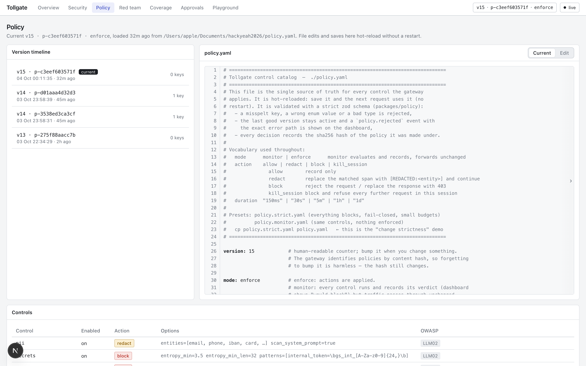

# Tollgate: one control layer for all AI agent traffic

- Agents read untrusted text (documents, web pages, tool output) and can act on it: call tools, spend tokens, leak context. Prompt injection, data exfiltration and runaway loops are already real incidents (EchoLeak CVE-2025-32711, ShadowRay, MCP tool poisoning).
- Controls today sit inside each app or inside the model vendor. A bank needs them in one place: defined once, enforced on the wire, auditable, independent of the model or framework.
- The brief: deterministic and semantic controls, budgets, a historical-attack feed, reporting, and a self-testing suite.

**Tollgate** is that layer. Local only: no cloud model is called anywhere.

---

# What Tollgate is

- An OpenAI-compatible HTTP proxy (Bun + Hono, port 8787). Point an agent's `base_url` at it and change nothing else.
- Governs model calls, and the tool definitions and tool calls inside them.
- One `policy.yaml` is the control catalog: controls, actions (allow, redact, block, kill_session), thresholds, budgets, feed source.
- Runs on a laptop: Ollama models, SQLite, a hash-chained audit log, a Next.js dashboard.

---

<!-- _class: small -->

# Hybrid pipeline and OWASP coverage

- **Tier 0, deterministic, ~0.5 ms:** auth and scopes, model allowlist, budget pre-check, Unicode normalisation, decode-and-rescan (base64, hex, URL, HTML entities), PII, secrets, injection heuristics, signature feed, canaries, tool definitions.
- **Tier 1:** local classifier with a hard timeout and fail-open / fail-closed. **Tier 2:** local LLM judge, strict JSON verdict, only in the uncertain band.
- **Output path:** redact, canary, link exfiltration, system-prompt leak, tool-call gate.
- Every decision carries tier, rule id, OWASP ids, per-stage latency, policy hash. Not covered on purpose: LLM08, LLM09, ASI09.

---

# Policy engine and live reload

- `policy.yaml` is parsed with a strict zod schema. A misspelt key or wrong enum is rejected with the exact path; the last good version stays active and a `policy.rejected` event appears on the dashboard.
- A save is live on the next request, no restart. Every decision records the policy hash, so a judge can edit a rule, resend, and see the hash change.
- `mode: monitor` records what would be blocked and forwards unchanged; `mode: enforce` acts.
- Three presets: `policy.yaml` (standard), `policy.strict.yaml` (everything blocks, fail-closed, small budgets), `policy.monitor.yaml`.

---

# Budgets and resource governance

- Per agent, with a default: tokens per hour, USD per day (from `pricing.json`, local models at $0 but metered), compute seconds per hour, requests per minute, max tool depth.
- Checked on an estimate before the model is called, reconciled with real usage after. Over budget returns 429 with `Retry-After` (rule `budget.*`, OWASP LLM10 / ASI08).
- Loop breaker: the same request repeated 5 times in 30 s is blocked. Circuit breaker: the upstream fails fast after repeated errors.
- Demo: the loop scenario ends in `budget.loop_breaker`.

---

<!-- _class: small -->

# Historical attack feed

`feeds/ai-exploits.json` is loaded from a file (watched) or a URL (polled) and validated. A security team can add signatures without touching the gateway. 14 entries ship; types: `regex`, `url-pattern`, `pickle-opcode`, `tool-description`, `version-range`.

| Incident | What Tollgate checks | Feed entry |
|---|---|---|
| JFrog: malicious Hugging Face pickles (2024) | pickle `GLOBAL` / `REDUCE` opcodes naming `os`, `subprocess`, `exec` | `jfrog-hf-pickle-rce-2024` |
| nullifAI, ReversingLabs (2025) | non-ZIP / truncated model archives are blocked | `nullifai-broken-pickle-2025` |
| ShadowRay, CVE-2023-48022 | tool calls to the Ray Jobs API (port 8265) | `shadowray-cve-2023-48022` |
| Probllama, CVE-2024-37032 | digest must match `sha256:[a-f0-9]{64}`; Ollama < 0.1.34 flagged | `probllama-cve-2024-37032-*` |
| EchoLeak, CVE-2025-32711 | markdown images to non-allowlisted hosts with long queries | `echoleak-cve-2025-32711` |
| MCP tool poisoning, CVE-2025-54136 | hidden instructions in tool descriptions | `mcp-tool-poisoning-2025` |

Plus generic patterns: reverse shell, `curl | sh`, SSRF to cloud metadata, jailbreak families.

---

# Reporting and audit

- **Overview:** posture score, requests and blocks, spend per agent, p50 / p95 latency per stage, policy banner.
- **Security:** filterable event table (agent, decision, tier, rule, OWASP id), event detail with redacted excerpts, JSONL / CSV export, approval queue for gated tool calls.
- **Audit log:** append-only JSONL, each line holds the SHA-256 of the previous line. The dashboard button and `bun run audit:verify` find the first tampered line. Secrets are masked before they are written.

---

<!-- _class: small -->

# Test suite and the Red Team Loop

- `bun test`: 503 pass, 2 skip (model-backed), 0 fail in about 35 s. YAML fixtures per control, each tagged with control id and OWASP ids, with a positive and a negative case. Also hot-reload, invalid-policy, audit-tamper and latency tests.
- Red Team Loop: 88 seed attacks (own, plus garak and promptfoo with attribution) times 13 mutators (base64, hex, URL, leetspeak, homoglyphs, zero-width, role-play, payload split, multi-turn, ...) against the live policy.
- Every bypass becomes a failing fixture in `tests/cases/generated/`.
- Depth 1, 1204 attempts: bypass rate **22.7 % on the first run, 15.7 % after the M7 fixes, 13.3 % after the hardening pass**. 83 former bypasses are now regression tests; 160 are still open, listed with a reason, and kept out of the pass count.

---

# Telemetry and performance

- Per-stage timers (auth, budget, tier 0, 1, 2, upstream, output) with p50 / p95 / p99: dashboard, `GET /metrics` (Prometheus text), and the `X-Tollgate-Latency` header.
- M1 Max, one Bun process:

| Stage | p50 | p95 |
|---|---|---|
| tier 0 | 0.48 ms | 2.1 ms |
| tier 1 (`llama-guard3:1b`) | 49 ms | 138 ms |
| tier 2 judge (`llama3.2:3b`) | 677 ms | 970 ms |
| gateway overhead, tier 0 only | 0.30 ms | 0.40 ms |

- Throughput on the tier-0 path: ~2,500 req/s (1 client), ~3,400 req/s (32 clients), 0 errors (`bun run bench`).

---

<!-- _class: small -->

# Limits and next steps

**Known limits**
- Semantic controls are bounded by 1B / 3B local models; bypass rates are published, not hidden.
- Streaming is buffered: the full completion is scanned, then re-emitted as SSE. No unscanned token reaches the client; time-to-first-token pays for it.
- The dashboard sends the admin token from the browser (demo only). Single node, SQLite. The audit chain is tamper-evident, not tamper-proof.
- Not covered: LLM08, LLM09, ASI09.

**Next**
- MCP transport proxy with manifest pinning (rug-pull detection); model-file scanning; taint tracking from tool output into privileged tool arguments.

**Run it:** `./scripts/setup.sh`, `bun run dev`, `bun test`. MIT licence. AI-use disclosure is in the README.
